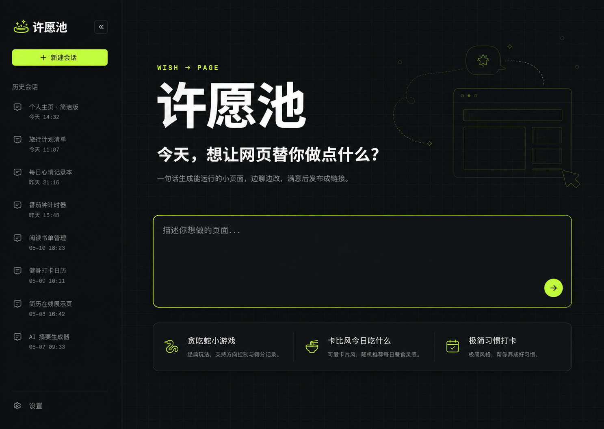
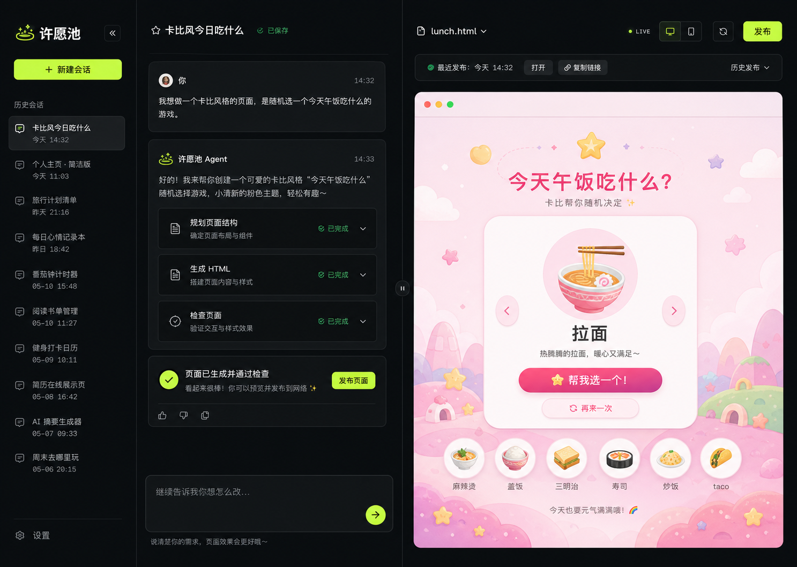

# 许愿池产品设计与实现决策 - 会议纪要

## 会议信息

- 日期：2026-07-16
- 话题：许愿池产品设计与实现决策
- 参与者：Human、Agent
- 项目/上下文：`/Users/paulchess/Desktop/Home/products/splice-ai-agent-team`
- 会议状态：已达成结论

## 结论摘要

在现有产品体系中新增与 `treasure-hunt`、`requirements-diagnosis`、`deep-diagnosis` 平级的第四个产品 `wish-creator`，中文名为“许愿池”。第一期提供受登录保护的 Hero 首页和带会话 ID 的 Session 页面，复用深度诊断的认证、服务端会话持久化和侧边栏交互，并把已经在 EVE demo 中实现的“对话生成单页 HTML、实时预览、发布到 OSS”能力迁移进主项目。

视觉方案已确定采用 2 号「Wish Launchpad」方向：深色网格实验台、荧光绿主操作和面向普通用户的清晰中文表达。Session 桌面端采用约 42:58 的 Agent/预览可拖拽分屏，移动端使用“对话 / 预览”双 Tab。历史发布本期不实现，仅作为明确代办保留；本期发布完成后只突出最近一次发布地址的打开与复制能力。

上述一期范围已完成实现与验证：许愿池的登录保护、会话持久化、单页 HTML 生成与修改、实时预览、OSS 发布及最近一次发布地址均已接入主项目；每次发布记录由服务端持久化，但历史发布 UI 仍按原决策保留为后续代办。主项目已统一升级到 AI SDK 7、Node.js 24 与 EVE 0.24.3，四个产品完成回归，Node 24 Alpine Docker 镜像构建成功。

首次创建的需求拆解路径也已从模型自行判断改为产品门禁：用户提交首页愿望后，固定选择“直接创建（推荐）”或“先拆解需求”。选择前不创建 Agent turn；拆解期间使用持久化状态隐藏并阻止 HTML artifact，只有最终确认“开始实现”后才释放。普通问答、局部修改和后续对话不重复进入该门禁。

### 已确认设计稿

#### Hero 首页

#### Session 会话页

## 议题与目标

### 原始问题

> “现在需要给这个页面添加第四个产品，和 treasure-hunt、requirements-diagnosis、deep-diagnosis 平级，叫 wish-creator。这个产品的中文名叫‘许愿池’。它的核心功能是在网页上通过跟 Agent 对话生产页面，可以发布成线上地址。”

### 最终目标

先完成产品与技术边界确认和视觉定稿，再将 EVE demo 的核心能力迁移到主项目；实现第一期可登录、可持久化会话、可生成和修改单页 HTML、可实时预览、可发布到 OSS 的完整用户路径，并对统一依赖升级后的另外三个产品做回归。

## 决策记录

### 决策 1：产品边界与一期页面

- 决定：新增独立产品路由 `/wish-creator` 与 `/wish-creator/session/[id]`；所有页面统一登录保护。
- 理由：许愿池是独立产品，同时深度诊断已经验证了登录、侧边栏和会话页的产品骨架。
- 约束与前提：积分本期不做；设置只保留账号信息和退出登录；Session 不保留 EVE demo 的 “EVE LAB” 说明区域。
- 被否决的方案：将许愿池藏在已有产品内部；只依赖浏览器本地存储；保留 demo 的实验说明侧栏。
- 影响：产品入口、路由、数据归属和界面导航均保持独立，认证与会话基础设施尽量复用现有实现。

### 决策 2：一期生成能力边界

- 决定：一期只生成单个自包含 HTML，CSS 与 JavaScript 内联；支持小工具、小游戏和静态小页面。
- 理由：浏览器内 Playground 需要先保证稳定、可预览、可发布的最小闭环。
- 约束与前提：不支持多页面、后端、数据库、外部 API 和图片上传；图片上传因当前 DeepSeek 模型不支持视觉能力，明确记为代办。
- 被否决的方案：一期直接支持完整应用、npm 任意依赖、联网能力或用户自定义后端。
- 影响：Agent 工具和执行环境可以按最小权限设计，不需要暴露宿主机 Docker Socket。

### 决策 3：会话、预览与过程展示

- 决定：桌面端左侧 Agent、右侧预览，默认约 42:58 并允许拖拽且记住比例；移动端使用“对话 / 预览”双 Tab，默认进入对话，历史会话放入抽屉。
- 理由：既保留 EVE demo 的核心工作流，又让非技术用户始终能理解当前进展和结果。
- 约束与前提：Agent 工具执行过程可见，技术参数与结果默认折叠；输入框固定在对话区底部。
- 被否决的方案：移动端强行保持左右分屏；默认展开完整 JSON 和执行日志；使用代码编辑器作为主界面。
- 影响：需要分别实现桌面和移动布局状态，并持久化桌面分屏比例。

### 决策 4：发布体验与作品隐私

- 决定：每次发布都生成新的 OSS 地址；一期界面只突出最近一次发布，支持打开和复制。发布由工具栏操作触发，在对话中出现一次确认卡片后执行，不再叠加第二个确认弹窗。
- 理由：OSS 发布模型天然产生新地址；一次明确确认能兼顾安全与操作效率。
- 约束与前提：作品默认不公开展示，仅知道链接的人可访问；未来公开到作品广场时，页面公开与对话详情公开必须分别征得同意。
- 被否决的方案：覆盖原地址；发布即默认公开；弹窗确认后再做一次卡片确认。
- 影响：服务端发布接口只接受受信任的生成结果；数据模型应为未来保存多次发布记录预留基础。

### 决策 5：历史发布本期不实现

- 决定：设计稿中出现的“历史发布”菜单本期不做，不提供入口或交互，记录为后续代办。
- 理由：一期优先验证生成、预览和最近一次发布的主路径，避免扩大交付范围。
- 约束与前提：本期保存并展示最近一次发布结果；服务端持久化每次发布记录，但不暴露历史 UI。
- 被否决的方案：一期同时交付完整历史发布菜单。
- 影响：实现时不能因为设计稿可见该控件而误做；后续补齐时再设计记录列表与恢复入口。

### 决策 6：未来“许愿”与作品列表的位置

- 决定：深度定制需求未来使用独立 `/wish-creator/wish` 结构化表单，Hero 只保留弱提示或侧边栏入口；作品列表未来使用独立 `/wish-creator/explore`，Hero 最多提供轻量入口或少量预览。
- 理由：两者都不是一期核心生成路径，独立页面更利于后续扩展和转化分析。
- 约束与前提：本期只记录产品方向，不实现页面和入口。
- 被否决的方案：在 Hero 再放一个长输入框承接定制需求；把完整作品流直接塞进 Hero。
- 影响：未来路由和数据模型方向明确，但当前代码不得提前实现推测性功能。

### 决策 7：视觉方向

- 决定：采用 2 号「Wish Launchpad」Hero 方案及其配套 Session 方案，保持深色模式，不做浅色主题。
- 理由：大字号“许愿池”、黑色网格、荧光绿主操作能够延续 EVE demo 的辨识度，同时比原 demo 更适合普通用户。
- 约束与前提：Hero 沿用深度诊断的侧边栏、历史会话、主输入和快捷创作入口结构；快捷入口使用“贪吃蛇小游戏”“卡比风今日吃什么”等创作场景。
- 被否决的方案：照搬深度诊断的浅色视觉；照搬 EVE demo 的原始实验台信息密度；采用 1 号或 3 号视觉方案。
- 影响：实现必须以两张确认稿为视觉基线，并在相同桌面视口下做截图对比和设计 QA。

### 决策 8：统一升级 AI SDK、Node.js 与 EVE

- 决定：不隔离新产品运行时，在主项目统一升级 AI SDK 6 到 7，并将 Node.js 运行时升级到 24；按照官方迁移说明修改用法，并回归另外三个产品。
- 理由：EVE 0.24.3 的 peer dependency 要求 `ai ^7.0.26`，且 EVE 要求 Node.js 24；隔离会增加长期运维成本。
- 约束与前提：Docker 构建与运行阶段已升级到 Node 24；EVE 自托管已适配 `eve build`、`.output` 运行代理和 `.workflow-data` 持久化。实际 Node 24 Alpine 镜像已构建成功；Docker Desktop 当时无法启动包括官方基础镜像在内的新容器，因此容器启动冒烟属于本机 Docker Desktop 环境问题，不影响镜像构建结论。
- 被否决的方案：让 `wish-creator` 独占另一套 Node/AI SDK 运行时；为规避升级而复制一套服务。
- 影响：升级属于全仓变更，必须执行 TypeScript、构建、测试和四产品回归，不能只验证许愿池。

### 决策 9：生产执行安全边界

- 决定：采用最小权限文件沙箱和受控工具集；不挂载宿主机 Docker Socket，不开放任意网络、任意 shell 或任意 npm 安装；OSS 发布由受信任服务端代码执行。
- 理由：一期仅需生成和校验单页 HTML，完整容器控制能力既无必要又扩大风险。
- 约束与前提：需要暴露必要的文件读写、HTML 校验和有限执行能力。
- 被否决的方案：让 Agent 直接控制宿主 Docker；开放无限制的命令和网络访问。
- 影响：不会限制一期创建、修改、预览和发布能力，但明确不支持完整应用工程、联网依赖和后端服务。

### 决策 10：首次创建由产品门禁决定是否拆解需求

- 决定：首页愿望提交后固定展示“直接创建（推荐）/先拆解需求”两条路径；选择前不把愿望发送给 Agent。“直接创建”通过一次性 `clientContext` 放行实现，“先拆解需求”进入 `grill-me`，并以 `awaiting-choice → grilling → released` 状态控制 artifact 展示。
- 理由：此前仅在 Agent 提示词中要求先调用 `ask_question`，模型会因需求看起来足够具体而直接生成，无法形成稳定产品行为。
- 约束与前提：只有首页提交的 pending prompt 被视为显式创建意图；空会话普通问答和已有会话后续消息不触发。`grilling` 期间若模型越权输出 artifact，客户端立即停止流并永久隔离该 revision，避免释放后残缺预览重新出现。
- 被否决的方案：让 `grill-me` 自动匹配所有创建请求；继续只强化提示词；所有空会话首条消息一律强制拆解。
- 影响：用户明确掌握是否进入访谈的选择权，控制上下文不进入可见聊天记录；需求门禁相关状态保存在会话级 `sessionStorage`。

## 实施结果

### 1. 一期产品闭环

- 已新增 `/wish-creator` 与 `/wish-creator/session/[id]`，所有页面均受登录保护。
- 已迁移 EVE Agent、单页 HTML 生成与修改、实时预览、会话持久化和 OSS 发布能力。
- 发布成功后突出最近一次地址并支持打开、复制；服务端保存每次发布记录，历史发布菜单仍未实现。
- Hero 与 Session 已按照两张确认设计稿完成桌面和移动端设计 QA。

### 2. 统一运行时升级与回归

- 主项目已统一采用 AI SDK 7、Node.js 24 与 EVE 0.24.3，没有为许愿池隔离第二套运行时。
- `treasure-hunt`、`requirements-diagnosis`、`deep-diagnosis` 与 `wish-creator` 均已完成回归。
- TypeScript、ESLint、EVE production build、Next.js production build、Shell 语法、Docker Compose 配置与 diff 检查均通过。

### 3. Docker 镜像验证

- 成功构建镜像 `splice-ai-agent-team:wish-creator-verify`，镜像 SHA 为 `8977f81e46ef62049851be3b71c81cc554686606d00be11bad157097d280037d`，平台为 `linux/arm64`。
- 修正了宿主机 `.output` 被复制进构建上下文后引发的跨文件系统 `EXDEV`，并补齐 Alpine 下 `node-liblzma` 所需的构建工具与运行库。
- 镜像构建过程已实际通过 Prisma Client 生成、EVE 构建、Next.js 16.2.6 编译和 Node 原生扩展编译。

### 4. 后续流式预览优化

- 首版运行验证暴露出模型生成完整 `write_file` 参数期间可能长期没有前端事件、容易被用户感知为“卡住”的问题。
- 该问题已经作为独立议题完成产品决策、实现与验证；详细过程见 [`许愿池流式预览交互优化-会议纪要.md`](./许愿池流式预览交互优化-会议纪要.md)，本纪要不重复展开其专用 artifact 协议与安全快照细节。

### 5. 首次需求拆解门禁

- 新增轻量路径选择卡，首页愿望在选择前只保存在 `sessionStorage`，不触发 EVE 会话或 HTML 生成。
- “直接创建”跳过 `grill-me`；“先拆解需求”要求逐项访谈，并用固定“开始实现”选项释放生成门禁。
- 门禁状态和被阻断 artifact revision 均可在同标签刷新后恢复；`hydrating` 只暂时隐藏预览，不会误判历史合法 artifact。
- 新增门禁回归测试，最终 `pnpm test:wish-creator` 通过 24 项；涉及文件 ESLint、`pnpm typecheck` 和完整 `pnpm build` 均通过。

## 关键讨论回放

### 1. 从功能平迁转向完整产品边界

- Human：最初提出把 EVE demo 的能力平迁到第四个产品，并参考深度诊断设计 Hero 与 Session。
- Agent：识别出发布隐私、认证、会话持久化、发布版本和未来作品公开等会影响数据模型的关键问题，逐项确认。
- 形成的共识：许愿池不是 demo 换皮，而是拥有独立路由、登录保护、持久化与未来公开边界的正式产品。

### 2. 发布记录的范围收缩

- 争议：每次 OSS 发布都会产生新地址，旧地址是否应该在一期界面可访问。
- Human 的质疑或补充：认可服务端保留每次发布记录、界面突出最近一次，并最初同意轻量历史菜单；在设计确认后进一步明确历史发布本期不做，只记为代办。
- Agent 的回应与修正：将“历史发布菜单”从一期功能移出，保留最近一次发布的打开和复制，并在实现范围中禁止误做设计稿里的历史控件。
- 关键转折：交付优先级从“避免旧链接消失”调整为“先闭环核心生成与最新发布”。
- 形成的共识：本期 UI 不实现历史发布，后续再补。

### 3. 从隔离运行时转向全仓统一升级

- 争议：EVE 对 AI SDK 7 和 Node.js 24 的要求是否应该只在新产品中隔离。
- Human 的质疑或补充：建议不隔离，统一升级，并要求查阅官方迁移说明、回归另外三个产品、验证现有发布是否支持 Node.js 24；同时关心安全限制是否会影响生成与发布。
- Agent 的回应与修正：确认当前 Docker 发布模型可以通过升级基础镜像支持 Node.js 24，但 Dockerfile、EVE 构建/运行代理与持久化仍需修改；解释最小权限沙箱不影响一期单页生成与 OSS 发布，只限制超出范围的完整应用能力。
- 关键转折：长期一致性和运维成本高于短期隔离的便利。
- 形成的共识：统一升级，配套全产品回归；安全能力按一期真实需求收敛。

### 4. 三套视觉方案收敛到最终设计

- Human：要求先设计、确认后再编码，并从三套 Hero 方向中选择 2 号。
- Agent：以 2 号 Hero 为母版补齐 Session 设计，明确桌面分屏、移动 Tab、工具过程、发布确认和最新发布状态。
- Human：确认 Hero 与 Session 设计稿，授权记录纪要后进入编码。
- 形成的共识：两张确认稿是本期实现与视觉 QA 的基线。

### 5. 从模型自行澄清转向用户可控的产品门禁

- Human：发现一个描述完整的贪吃蛇愿望没有触发 `grill-me`，并追问现有机制是否合理。
- Agent：核对会话事件、Agent 指令和 Skill 契约，确认缺失的是前置 `ask_question`；根因是产品流程仅由提示词软约束，而 `grill-me` 本身设计为用户同意后才能加载。
- Human：认可“直接创建（推荐）/先拆解需求”的轻量选择，并同意实施。
- Agent：最初只在选择前建立门禁；代码复审进一步发现普通问答误拦截、拆解期间越权 artifact、hydration 误封和释放后残缺 revision 重现等边界，随后增加显式创建意图、三态恢复和 revision 隔离。
- 关键转折：讨论目标从“让 grill-me 更容易触发”调整为“让用户稳定决定是否进入 grill-me，并由产品层保护生成边界”。
- 形成的共识：Skill 不应自动劫持需求；选择权属于用户，门禁与预览安全由产品编排负责。

## 未决问题

无。历史发布、图片上传、深度定制入口和作品广场均已明确为后续代办，不属于本期未决范围。

## 行动项

- [x] 实现 `wish-creator` Hero 与 Session 页面及登录保护｜负责人：Agent｜完成：2026-07-16
- [x] 迁移 EVE demo 的 Agent、单页 HTML 生成、预览和 OSS 发布能力｜负责人：Agent｜完成：2026-07-16
- [x] 统一升级 AI SDK 7 与 Node.js 24，适配 EVE 自托管构建与运行｜负责人：Agent｜完成：2026-07-16
- [x] 回归 `treasure-hunt`、`requirements-diagnosis`、`deep-diagnosis` 与 `wish-creator`｜负责人：Agent｜完成：2026-07-16
- [x] 对照两张确认设计稿完成桌面与移动端设计 QA｜负责人：Agent｜完成：2026-07-16
- [x] 实现首次创建路径选择、需求拆解门禁和越权 artifact 隔离｜负责人：Agent｜完成：2026-07-16
- [ ] 后续实现历史发布菜单｜负责人：未指定｜期限：未指定
- [ ] 后续评估图片上传、`/wish-creator/wish` 与 `/wish-creator/explore`｜负责人：未指定｜期限：未指定

## 参考资料

- `app/deep-diagnosis/`
- `/Users/paulchess/Desktop/Home/research/eve-research/demo`
- 深度诊断 Hero 参考图：`/var/folders/vg/5rpk15x52jj504tm760gtvm80000gn/T/codex-clipboard-ea27dd42-d3c7-4b33-97b2-a0c1f6139871.png`
- EVE demo Session 参考图：`/Users/paulchess/Library/Containers/com.tencent.xinWeChat/Data/Documents/xwechat_files/wxid_t8t97udhf60x12_cf44/temp/RWTemp/2026-07/7c9e3ea566d0417f9bd761969242f895/e30c95a8fbc44c02494d764c0d8c68ca.png`
- [AI SDK 7 migration guide](https://ai-sdk.dev/docs/migration-guides/migration-guide-7-0)
- [AI SDK 7 announcement](https://vercel.com/blog/ai-sdk-7)
- [Docker Official Image: Node.js](https://hub.docker.com/_/node/)
- 已确认 Hero 设计稿：`./assets/wish-creator-hero-confirmed.png`
- 已确认 Session 设计稿：`./assets/wish-creator-session-confirmed.png`
- 实施验证记录：`design-qa.md`、`Dockerfile`、`.dockerignore`
- 后续专项纪要：`./许愿池流式预览交互优化-会议纪要.md`
- 需求门禁实现：`components/wish-creator/WishCreatorRequirementGate.tsx`、`lib/wish-creator/requirement-gate.ts`、`lib/wish-creator/requirement-gate-storage.ts`、`agent/skills/grill-me/SKILL.md`
- 验证命令：`pnpm test:wish-creator`、`pnpm typecheck`、`pnpm lint`、`pnpm build`、`docker build --progress=plain -t splice-ai-agent-team:wish-creator-verify .`
