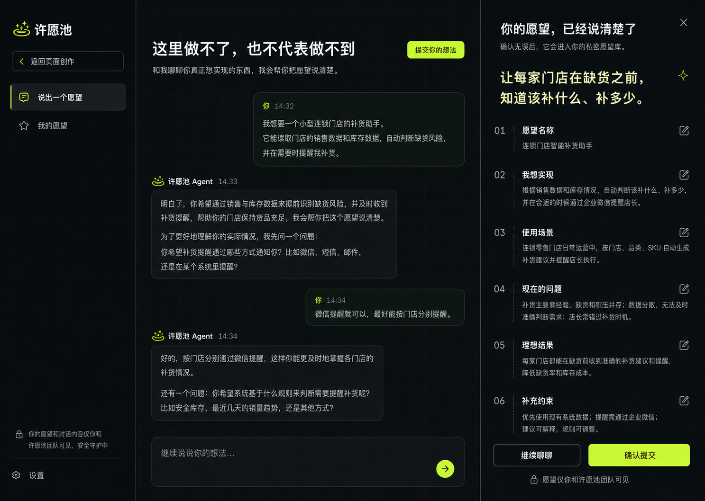

# 许愿池愿望承接与 AI 对话设计 - 会议纪要

## 会议信息

- 日期：2026-07-16
- 话题：许愿池愿望承接与 AI 对话设计
- 参与者：Human、Agent
- 项目/上下文：`/Users/paulchess/Desktop/Home/products/splice-ai-agent-team`
- 会议状态：已达成结论

## 结论摘要

许愿池后续的“定制服务承接”不采用传统表单，也不让现有网页生成 Agent 判断何时转人工，而是新增一条独立、私密的愿望链路：用户从主产品侧边栏的解释型入口进入独立愿望 Agent，通过自然对话把平台暂时无法完成的愿望说清楚，再主动点击“提交你的想法”。AI 根据完整上下文生成六项结构化摘要，用户可行内修改、返回继续聊，并在确认后形成正式愿望。

愿望与作品严格分离：作品可以公开，愿望永远私密。“我的愿望”承接用户已经开始表达的愿望草稿和确认提交后的正式愿望，但不作为通用 Agent 会话历史，也不承诺研发进度。后台保存最终摘要和原始对话，并由 AI 生成平台能力缺口标签，提供只读统计、搜索和内容分析；一期不做人工状态、优先级、CRM、积分扣费、图片或文件上传。

交互与视觉采用现有许愿池深色网格、荧光绿和中文产品语言。最终确认稿组合了设计图 1 的完整侧边栏与卡片式 Agent 对话区域，以及设计图 3 的“主愿望金句 + 01–06 编号摘要”右侧确认面板。

### 已确认设计稿

## 议题与目标

### 原始问题

> “我们希望知道大家有哪些解决不了的需求，像许愿池一样，可以像我们许愿，说出他的诉求，后台会有统计记录，我们自己会去分析，然后用户也可以联系到我们，我们来做面对面定制分析等等。”

### 最终目标

在不干扰许愿池“小应用快速生成”主路径的前提下，建立一条 AI-native 的私密愿望承接链路：帮助用户把尚未解决的需求说清楚，形成本人确认的愿望摘要，支持后续主动人工沟通，并为平台提供可分析的真实能力缺口数据。

## 决策记录

### 决策 1：愿望的第一目标是收集真实需求，定制沟通是第二层转化

- 决定：一期核心目标是收集、理解和分析平台暂时解决不了的真实愿望；人工定制作为用户提交后的可选后续路径。
- 理由：这更符合“许愿池”的定位，也能避免入口一开始就表现成销售留资。
- 约束与前提：愿望提交不以联系方式为前置条件；用户可在提交后主动进入人工沟通。
- 被否决的方案：把愿望入口直接做成预约定制或销售线索表单。
- 影响：产品成功首先看有效愿望的数量与可分析性，人工沟通点击作为独立信号记录。

### 决策 2：愿望永远私密，与公开作品完全分离

- 决定：原始愿望、最终摘要和愿望对话只对提交者与许愿池团队可见，不进入作品广场，也不支持公开、点赞或评论。
- 理由：愿望可能包含业务流程、公司问题和后续联系方式；它与可公开展示的作品不是同一类对象。
- 约束与前提：即使未来展示趋势，也只能使用脱敏后的聚合结果，不能公开原始愿望。
- 被否决的方案：公开愿望墙、愿望投票、默认公开后再让用户关闭。
- 影响：数据模型、权限、用户界面和后台分析均需明确区分愿望与作品。

### 决策 3：只做常驻入口，不做 Agent 自动判断的情境入口

- 决定：在许愿池侧边栏增加解释型承接卡，使用“这里暂时做不了？”、“告诉我们你还想实现什么”和“去许愿”等连续文案完成主功能到愿望链路的过渡。
- 理由：单独的“提交愿望”四字与网页生成主功能衔接较弱；解释型入口能说明它承接的是当前平台边界之外的需求。
- 约束与前提：不让网页生成 Agent 判断某个需求是否应该转入愿望，以免误判干扰正常生成体验。
- 被否决的方案：只有一个孤立的“提交愿望”菜单项；当 Agent 认为做不了时自动出现承接卡。
- 影响：入口长期可发现，但不会劫持或降低网页生成主路径的可用性。

### 决策 4：愿望采用独立 AI 对话，不采用传统表单

- 决定：从侧边栏进入独立愿望 Agent；用户像正常聊天一样表达需求，AI 通过顾问式引导帮助用户把愿望说清楚。
- 理由：传统多字段表单不够 AI-native，也容易把用户拉回填写需求文档的负担中。
- 约束与前提：愿望 Agent 不生成 HTML、不预览页面、不发布作品，也不拥有网页生成工具。
- 被否决的方案：单个自然语言输入框直接提交；多字段结构化表单；在现有网页生成 Agent 中使用 `mode=wish` 隐式切换行为。
- 影响：需要独立的愿望 Agent、会话类型和业务路由，但可复用现有 Session 页的视觉骨架、聊天组件、认证与持久化基础设施。

### 决策 5：用户决定何时提交，AI 不设置强制门槛

- 决定：用户发出第一条需求消息后即可使用“提交你的想法”；AI 可以继续追问并提示信息已经足够，但不能自动提交或锁死按钮。
- 理由：愿望的完整程度由用户掌控，AI 的职责是帮助表达，不是把对话变成强制问卷。
- 约束与前提：AI 每次最多追问一个最有价值的问题，并优先澄清目标、场景、当前问题和理想结果。
- 被否决的方案：AI 达到内部完整度阈值后才解锁提交；AI 自动结束并提交愿望。
- 影响：需要明确区分“对话中的完整度建议”和“用户发起的正式提交动作”。

### 决策 6：提交时生成六项摘要，并在确认后形成正式愿望

- 决定：用户点击“提交你的想法”后，AI 根据完整对话生成愿望名称、我想实现、使用场景、现在的问题、理想结果和补充约束六项摘要。
- 理由：六项结构足以让用户确认理解是否准确，也能支撑后台分析，但不会膨胀成商业需求文档。
- 约束与前提：补充约束没有内容时可不展示；需求类别、能力缺口等内部字段不出现在用户确认卡中。
- 被否决的方案：提交原始聊天文本作为愿望；在用户侧展示复杂度、定制适配度等运营标签。
- 影响：提交是“生成摘要 → 用户确认 → 写入正式愿望”的两阶段动作。

### 决策 7：确认面板支持直接编辑，也允许返回继续聊

- 决定：小修改通过摘要字段行内编辑完成；如果 AI 理解方向不对，用户可选择“继续聊聊”回到对话，再次提交时重新生成摘要。
- 理由：只让用户重新对话会让简单修正成本过高，只让用户改表单又会削弱 AI 对话的价值。
- 约束与前提：未确认的临时摘要不是正式愿望；只有“确认提交”后才落库。
- 被否决的方案：摘要只读；任何错误都必须回到对话；点击提交后直接写入后台且不可确认。
- 影响：前端需要明确维护对话、临时摘要和正式愿望三个状态边界。

### 决策 8：区分愿望对话与已提交愿望

- 决定：愿望对话是帮助用户澄清需求的过程对象；用户已经开始表达的愿望草稿进入“我的愿望”，并可返回原会话继续说清楚。确认提交后，同一条目切换为正式愿望并进入摘要详情。
- 理由：用户既需要继续未完成的愿望，也需要回看自己确认过的愿望资产，但不需要维护一套通用 Agent 会话历史产品。
- 约束与前提：“我的愿望”只收录存在有效用户表达的愿望会话；草稿展示首次诉求、最近更新时间和“继续说清楚”，正式愿望展示标题、核心诉求、提交时间和私密标识。详情展示六项摘要与“聊聊怎么实现”，不公开原始对话、内部分析或研发进度。
- 被否决的方案：完全不提供愿望历史；照搬现有 Session 的 Agent 会话历史界面；展示内部排期与处理状态。
- 影响：需要分别建模愿望会话与正式愿望，并提供列表、详情和权限校验。

### 决策 9：用户侧移除是软删除，后台分析不受影响

- 决定：已提交愿望不可编辑，但用户可以通过“从我的愿望中移除”将其从个人列表和详情中隐藏；后台记录和统计继续保留。
- 理由：用户已经在提交前确认内容，正式愿望应保持稳定；同时用户需要控制个人界面中是否继续展示。
- 约束与前提：界面不能声称永久删除；确认文案只说明“移除后不再出现在我的愿望中，且无法恢复”。后台不需要显示或筛选用户移除标识。
- 被否决的方案：提交后继续静默改写愿望；硬删除后台记录；在后台页面突出显示用户已移除状态。
- 影响：数据层需要用户侧软删除字段，但后台查询和分析按普通愿望处理。

### 决策 10：人工承接由用户主动发起

- 决定：愿望确认提交后提供“聊聊怎么实现”，展示企业微信等直接联系方式；不额外要求用户留下联系方式或等待平台回访。
- 理由：未来手机号登录可自然关联用户身份，没有必要重复设计一套回访留资表单；主动联系也更少销售压力。
- 约束与前提：愿望提交本身不受联系动作影响；后台记录人工沟通入口的点击信号。
- 被否决的方案：联系方式必填；“由我们联系你”的额外留资分支；提交前强推定制沟通。
- 影响：可复用项目现有顾问企业微信二维码资产和交互基础，但视觉需要适配许愿池深色主题。

### 决策 11：后台一期只做只读分析

- 决定：新增愿望后台，提供愿望总数、提交用户数、时间趋势、人工沟通入口点击数、愿望列表、搜索、筛选、详情和原始对话。
- 理由：仅写入数据库无法支撑团队直接分析；但当前没有证据需要完整运营或销售流程。
- 约束与前提：不增加处理状态、机会方向、优先级、人工备注、任务分配或 CRM。
- 被否决的方案：只保存原始记录并依赖查库；一期直接建设运营状态机和销售漏斗。
- 影响：后台可作为独立 `/admin/*` 页面接入现有权限模式，无需同步重构统一后台首页。

### 决策 12：AI 在提交时生成内部能力缺口标签

- 决定：在生成用户可见六项摘要的同时，AI 输出仅后台可见的平台能力缺口标签、简短判断依据和分析版本。
- 理由：团队要回答“用户主要被哪些平台能力卡住”；如果没有稳定分类，只能逐条人工阅读，无法形成高频统计。
- 约束与前提：同一愿望可以命中多个能力缺口；标签不影响用户提交，也不触发自动业务决策；原始摘要和对话必须保留以支持未来重跑分析。
- 被否决的方案：只统计愿望总数；要求用户自行选择能力分类；用 AI 标签自动决定是否承接定制。
- 影响：正式愿望需要保存带版本的内部分析结果，并允许未来更换分类标准后重新分析。

### 决策 13：愿望 AI 的角色是帮助说清楚，不是销售或方案承诺

- 决定：愿望 AI 先回应用户真正关心的内容，再自然补问；每次最多问一个问题，不承诺一定能做、排期或报价，也不在对话中频繁推销人工定制。
- 理由：核心目标是通过引导把愿望说清楚；过早给方案或转销售会损害表达质量和信任感。
- 约束与前提：用户主动询问实现方式时可以给方向性回应，但人工沟通主入口仍在提交成功后。
- 被否决的方案：把愿望 Agent 设计成强销售顾问；照模板逐字段审问；直接给确定性实现承诺。
- 影响：Agent prompt、评测用例和 UI 文案都需要围绕“理解与澄清”设计。

### 决策 14：一期免费、仅支持文字，但为后续扩展保留方向

- 决定：一期愿望对话和提交暂不接入现有积分体系，也不支持图片或文件上传。
- 理由：愿望链路同时为平台提供产品输入，不应在一期增加付费门槛；附件会引入存储、权限、内容安全和后台查看等额外复杂度。
- 约束与前提：未来可能接入积分，也可能允许客户上传既有资料；本期不提前实现相应配置或基础设施。
- 被否决的方案：一期即按对话轮次扣积分；为愿望 Agent 单独提前建设附件系统。
- 影响：当前聊天输入只展示文字能力，架构拆分时避免把未来计费和附件扩展彻底封死。

### 决策 15：确认视觉由图 1 左侧与图 3 右侧组合

- 决定：保留图 1 的完整侧边栏、卡片式 Agent 对话、顶部“提交你的想法”和底部输入区；右侧采用图 3 的大号愿望金句、01–06 编号摘要、行内编辑、继续聊聊和确认提交。
- 理由：图 1 的左侧与现有许愿池 Session 信息密度和交互最一致，图 3 的右侧比传统表单更有“对话变成清晰愿望”的 AI-native 感受。
- 约束与前提：继续沿用现有深色网格、荧光绿、中文排版和品牌资产；不引入新主题或无关功能。
- 被否决的方案：完整采用单张方案；使用图 3 的窄图标侧栏；使用图 1 右侧较传统的字段列表。
- 影响：合并确认稿成为后续前端实现和设计 QA 的视觉基线。

## 关键讨论回放

### 1. 从“需求收集表”转向 AI-native 愿望对话

- Human：最初确认用户侧应该轻量表达、后台负责结构化分析，但随后明确改变判断，认为表单“太传统，太不 AI native”。
- Agent：将流程重构为独立愿望 Agent，通过正常对话引导用户表达，再由“提交你的想法”触发结构化总结与确认。
- 关键转折：用户价值不再只是向平台提供信息，而是先通过 AI 把自己的愿望说清楚。
- 形成的共识：愿望入口必须是对话体验，结构化模板只在提交确认阶段出现。

### 2. 从“不做我的愿望”转向保留愿望、隐藏通用会话细节

- 争议：最初讨论传统表单时，Human 认为不需要“我的愿望”；引入独立 AI 对话后，如何处理持久化和历史再次成为问题。
- Human 的质疑或补充：明确需要“我的愿望”入口查看提交历史，但它不是当前 Session 的 Agent 会话历史。
- Agent 的回应与修正：拆分“愿望对话”和“已提交愿望”两个对象；“我的愿望”以愿望为单位展示草稿和正式记录，草稿可返回原会话继续表达，正式记录进入摘要详情。
- 关键转折：愿望对话不仅是后台过程，也承担用户继续未完成表达的入口，但不能退化成通用 Agent 会话历史列表。
- 形成的共识：保留“我的愿望”中的愿望草稿与正式结果，永远不公开内部分析和无关 Agent 会话。

### 3. 从硬删除建议转向用户侧软删除

- 争议：Agent 最初建议用户删除愿望时同步删除最终记录和对话。
- Human 的质疑或补充：删除不能影响后台数据，应采用软删除。
- Agent 的回应与修正：改为“从我的愿望中移除”，只控制用户侧可见性，后台记录与统计保留；后台也不需要额外展示移除标识。
- 关键转折：用户界面管理与平台研究数据保留是两套不同语义。
- 形成的共识：正式愿望稳定不可编辑，用户可移除且无法恢复，后台分析不受影响。

### 4. 从单一后台状态模型转向只读统计

- 争议：Agent 曾建议增加待查看、已查看、已归档，以及机会方向和优先级等管理字段。
- Human 的质疑或补充：这些标记暂时没有必要，等真正需要运营管理时再增加。
- Agent 的回应与修正：后台范围收缩为统计、搜索、列表、详情、原始对话与 AI 能力缺口分析，不做人工状态或 CRM。
- 关键转折：当前目标是发现需求模式，不是建设完整的线索运营系统。
- 形成的共识：一期只做可分析的只读后台。

### 5. 从三套视觉方向收敛为组合方案

- Human：在三套 Product Design 视觉方案中，选择图 1 的侧边栏与 Agent 对话区域，同时选择图 3 的右侧预览/确认区域。
- Agent：根据两张选定参考生成合并确认稿，保持图 1 左侧比例和卡片对话，替换为图 3 的编号式愿望摘要。
- 关键转折：不强迫整张方案二选一，而是围绕已确认的信息层级组合最合适的局部。
- 形成的共识：当前文档引用的合并图是正式视觉基线。

## 未决问题

- 愿望对话后续何时接入积分、采用何种计费规则，尚未决定。
- 图片和文件上传后续何时实现，以及资料存储、权限和安全边界，尚未决定。

## 行动项

- [x] 完成愿望承接需求拆解并确认产品边界｜负责人：Human、Agent｜完成：2026-07-16
- [x] 完成三套视觉探索并生成合并确认稿｜负责人：Human、Agent｜完成：2026-07-16
- [x] 将本次讨论整理为项目会议纪要并引用确认稿｜负责人：Agent｜完成：2026-07-16
- [x] 依据确认稿实现愿望 Agent、提交确认、“我的愿望”和后台分析链路｜负责人：Agent｜完成：2026-07-20
- [ ] 后续评估积分接入与附件能力｜负责人：未指定｜期限：未指定

## 参考资料

- `TODO.md`
- `docs/业务需求.md`
- `docs/meetings/2026-07-16/许愿池产品设计与实现决策-会议纪要.md`
- `docs/meetings/2026-07-16/许愿池流式预览交互优化-会议纪要.md`
- `docs/meetings/2026-07-16/assets/wish-creator-hero-confirmed.png`
- `docs/meetings/2026-07-16/assets/wish-creator-session-confirmed.png`
- `docs/meetings/2026-07-16/assets/wish-creator-intake-confirmed.png`
- `design-qa.md`
- `prisma/schema.prisma`
- `components/wish-creator/WishCreatorLanding.tsx`
- `components/wish-creator/WishCreatorNavigation.tsx`
- `components/wish-creator/WishCreatorRequirementGate.tsx`
- `components/wish-creator/WishCreatorSessionShell.tsx`
- `components/requirements-diagnosis/ConsultationQrDialog.tsx`
- `lib/wish-creator/persistence.ts`
- `types/wish-creator.ts`
